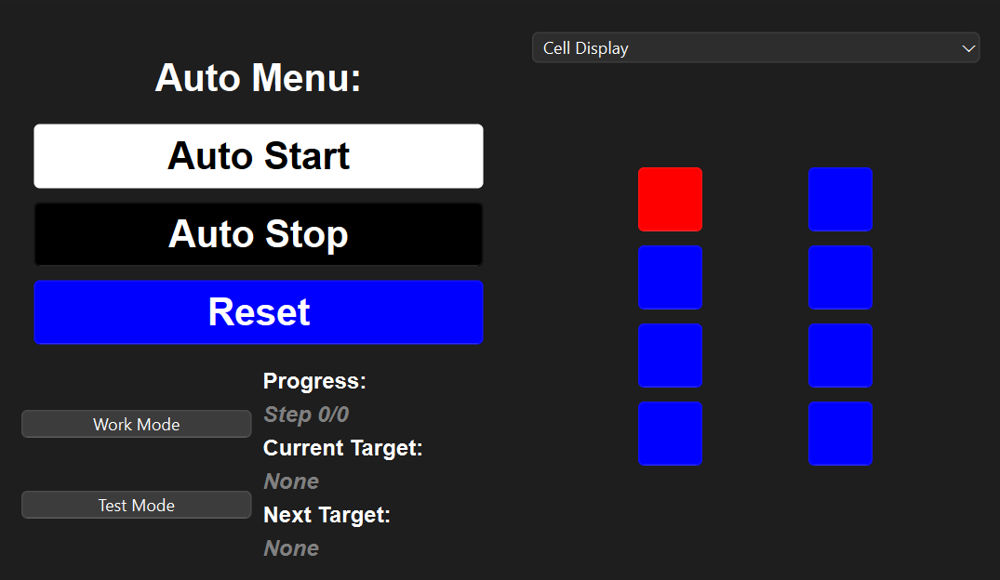
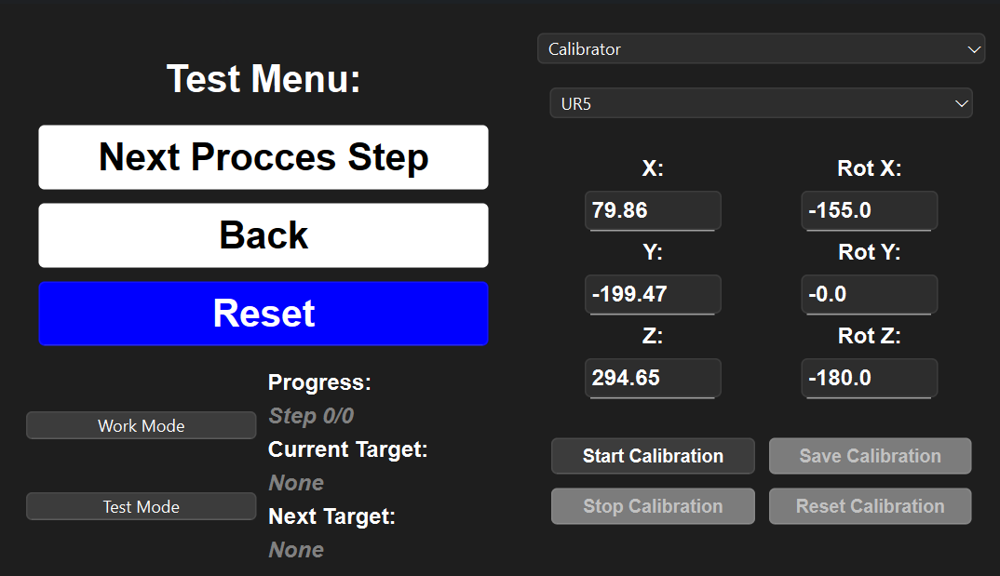

# AAU P2 Project - Autonomous dissasembly of EBV's

This is a part of group 261's project submisson for the Robtic 2nd year, spring 2025 semester project at Aalborg University. One this page you'll find all the software developed in relation to the project.

## What can it do???

Our goal for the project was to develope of robotic cell that could disassemble, and take our the bad cells, from our provied simplified model of an BMW i3 battery using an UR5 robot. 

We wanted to try and develope a piece of software where the whole proccess could be controlled by one intuitive piece of software, and not rely so much on the UR5's teachpendant. We ended up with the following below.
<div style="display:flex;width:450px">


</div>
From here you can both track the proccess of the program, and calibrate and adjust specific frames if needed, while also maunally moving the arm around the choosen local frame.

### The final setup:


## Simulation enviorment

In order to allow for easy developement we also ended up with a pretty capable simulation setup which can be seen below.


In the simulation URSim is used simulate the UR5 Controller. RoboDk is then used to build the cell, while mimicing the controller position, which is controlled by our program.

## How to run the simulation
First clone the repository and enter the repository:
```bash
git clone https://github.com/Sanu546/P2.git
cd p2
```
### Setup URSim

1. First install URSim in as a virtual machine using, VirtualBox using the offical guide [here](https://www.universal-robots.com/download/software-cb-series/simulator-non-linux/offline-simulator-cb-series-non-linux-ursim-3158/).
2. Then boot up the Virtual Machine with a "Host-Only" network adapter
3. Lastly load the [UR5 program files](https://github.com/Sanu546/P2/tree/main/rtde_stuff/UR5%20program) on the URSim

### Setup RoboDK

1. Start RoboDK and load the [RoboDK file](https://github.com/Sanu546/P2/blob/main/roboDK/P2_sim_setup.rdk) file.
2. Then while URSim is running, run the "robot_awesome" which is places in the root of the station tree.
3. Now the UR5 robot should mimic the robot which URSim is simulating.

### Setup EVB Python program

1. Then inside create and activte a virtual envitorment, while also installing the pip requirements:
    
    #### Windows:
    
    ```bash
    python3 -m venv .venv
    .venv/Scripts/activate
    pip install -r requirements.txt
    ```
    #### Linux:

    ```bash
    python3 -m venv .venv
    source .venv/bin/activate
    pip install -r requirements.txt
    ```
1. Lastly run the main.py program.
    ```bash
    python3 main.py 
    ```